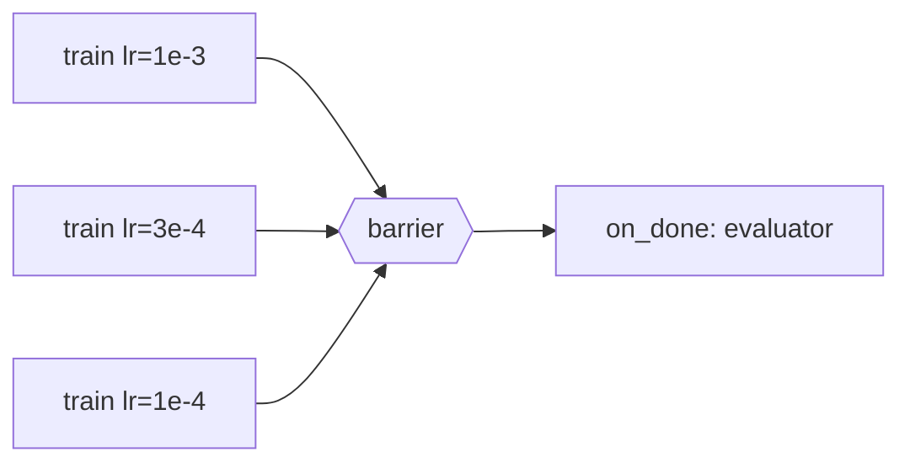

# Pekáreň — design

The design the code in this repository is built against. Decisions taken
while implementing it, and the alternatives they beat, live in
[`adr/`](adr/); what is built and what is not is in
[`roadmap.md`](roadmap.md).

## Overview

Pekáreň is a daemon-free Rust job queue that lets an LLM agent submit
long-running work, walk away, and have results evaluated without waking its
expensive context. It targets a single machine first, with a path to several
nodes later.

The core problem is context economics. An agent may hold 500k tokens of
context, but judging whether a training run succeeded rarely needs all of it.
Re-waking that context after an hour means paying for it again once the
prompt cache has gone cold. Pekáreň stores an evaluation prompt on each job
at submit time, while the agent still knows what success looks like. When the
work finishes, a fresh small context can judge the output. The original agent
comes back only when it is cheap (cache still warm) or when the user
explicitly asks.

The library will ship with a skill so agents know how to use it, since this
belongs in the harness but is not there today.

## Core model

State lives in a directory on disk, backed by SQLite in WAL mode. There is no
daemon and no broker: every process that touches the store is a client and
potentially a worker.

**Handles.** `submit` returns a `JobId`, a small `Copy` value. Everything
else takes `JobId`s, so the graph is built by value and nothing blocks until
the caller explicitly waits.

**Job definition.** A builder describes each job: the command to run,
declared resources (CPU cores, GPU count, memory, estimated duration),
dependencies on other `JobId`s, the evaluation prompt, retry count, and
whether the job is safe to re-run.

**Rust as the scripting surface.** Agents write a single `.rs` file with an
inline dependency manifest, so there is no project scaffolding. Loops and
fan-outs are ordinary code.

**A job can be a function.** `Job::task` submits a function registered in
the submitting binary, and a worker runs it by re-executing that binary.
The job body is compiled, checked Rust rather than a string; the store holds
the binary's path and the registered name, because a job outlives the
process that submitted it and a closure cannot be written to a row. Code
with no binary to live in — something generated on the spot — goes through
`Job::rust_file` or `Job::rust` instead and runs as a single-file script.

**What a job assumed.** Every path a job depends on is hashed at submit
time and re-hashed before it runs: the binary or script it runs, which
fails the job if it changed, and inputs declared with `watch`, which warn.
A rebuilt binary judged against an hour-old evaluation prompt is not the
job that was submitted.

**Grace window.** After submitting, the script stays attached for a short
window (5–10 s). A job that dies in that window almost always failed on
something trivial, such as a bad path or missing binary, and that failure
returns as an error from `submit` itself, while the agent still holds the
thread. Past the window the script detaches and all outcomes go through one
completion path: one channel with two latencies, not two channels.

## The DAG

Jobs form a DAG: a submit may depend on any existing `JobId`, including jobs
already running. A **barrier** is a node with no command of its own that
fires when its dependencies settle. Notification hangs off barriers, not
leaves, so the expensive context is pinged once per subgraph rather than once
per job.

| Policy | On a failed dependency | Suits |
| --- | --- | --- |
| Fail-fast (default) | Mark barrier failed and notify immediately | Pipelines where one failure invalidates the rest |
| Fail-at-end | Mark barrier failed, wait for the remaining jobs, notify once with the full picture | Sweeps where a missing point is tolerable |

The tradeoff is wasted compute against wasted wake-ups. Fail-fast is the
default because it is the safer surprise.

## Wake-up policy and handoff

The last worker to finish a barrier's dependencies spawns whatever comes
next, as its final act before exiting. This keeps the system daemon-free.

**Claiming the notification.** Finishing workers race to claim the barrier's
notification with a conditional write; exactly one wins. If the winner
crashes mid-handoff, the claim stays unfulfilled and the next process to
touch the store picks it up.

**What gets spawned** is a command stored on the barrier. The library does
not interpret it.

| Situation | Action |
| --- | --- |
| Original agent's cache still warm | Resume the original session |
| Cache cold | Spawn a fresh evaluator with the stored eval prompt and the job outputs |
| User asks to review | Resume the original session, regardless of cache |
| No agent needed | Run a script that pings the user |

The wake-up policy is a per-job or per-barrier knob, not a fixed rule.

## Failure and restart

Pekáreň guarantees exactly-once commits: a job's result is recorded by one
worker only, even if two copies ran. The dangerous state is a job marked
running that nobody is actually running.

**Leases, not flags.** A worker claims a job with a lease expiring 1–2
minutes out, plus a unique token, and renews while alive. If the worker dies,
renewal stops and the lease rots. Any process that later reads the store can
reclaim a stale lease. No heartbeat daemon is needed, only timestamps.

**Conditional commit.** When a worker finishes, it writes `done` only if the
lease still holds its token (compare-and-swap). If another process reclaimed
the job, the token changed, the write fails, and the stale worker discards
its output.

**Side effects.** The store is safe, but files are not. Jobs write output to
a scratch directory keyed by lease token, and the worker moves it into place
only after a successful commit.

**Early checks.** A worker also checks its own lease before anything
expensive or destructive. This catches the frozen-box case, where the process
is alive but its lease has already lapsed.

**Restart policy** is declared per job: `retries(n)` for how many times to
re-run on failure, and `idempotent(bool)` for whether re-running is safe — a
job that appends to a database goes straight to failed instead.

## Stuck jobs

Stuck jobs can be killed without a daemon, because the supervising worker or
a later reclaiming process is always around to do it.

| Case | Detection | Action |
| --- | --- | --- |
| Job runs too long, worker alive | Worker enforces a wall-clock cap, default 3× the declared estimate | Worker kills the child |
| Worker died, child orphaned | Lease expires | Reclaimer kills the recorded process, then restarts the job |
| Job alive but idle | Profiler sees ~0 CPU for 20 min on a job declared compute-bound | Flag as stalled; kill per policy |

**Orphan reaping.** The worker records the child's PID and process start time
in the store. The reclaimer kills only a process matching both, because PIDs
get recycled and killing a stranger is worse than leaving an orphan.

## Resource scheduling

The store holds a ledger of resources currently leased out. A worker claims a
job only if the free pool covers its declaration, using the same conditional
write as the lease: read the pool, pick a slice, commit only if nothing
changed underneath.

| Resource | Model | Enforcement |
| --- | --- | --- |
| CPU | Counted (e.g. 4 of 16 cores) | Admission control; optional pinning to specific cores |
| GPU | Named devices, tracked individually | Worker sets `CUDA_VISIBLE_DEVICES` to the claimed indices before exec |
| Memory | Declared amount | Admission control only; the OOM killer is the backstop |

**GPUs are named, not counted.** Device 0 and device 1 are not
interchangeable once something is resident. The child sees only its assigned
devices and refers to them as device 0 onward.

**Memory is loose on purpose.** Real enforcement means cgroups, which is
Linux-specific and fiddly. Declared memory prevents obvious overcommit, such
as two 40 GB jobs on a 64 GB box.

**Starvation (parked).** Small jobs can keep slipping past a large one. The
planned fix: once a job has waited past a threshold, it reserves capacity
rather than asking for it, and smaller jobs stop jumping the queue.

## Profiling and estimates

Every job's declaration does double duty: it drives admission control, and it
is the baseline its actual run is compared against.

**Sampling.** A thread in the worker samples the child every few seconds:
resident memory, CPU time, and GPU utilization where available. The cost is
negligible, and the result is a crude shape of the run.

Recorded per job: wall-clock duration declared vs actual, peak resident
memory, average cores used, GPU utilization (average and peak), and the idle
fraction — time spent waiting rather than computing.

**Why it matters to the agent.** A line like "estimated 20 min, took 90 min,
averaged 1.2 of 8 cores" is actionable. It tells the evaluator the job was
I/O-bound or misconfigured, and it improves the agent's next estimate. The
same samples feed the stall detection above.

## Open questions

- **CLI surface.** Deferred. Sketch so far: `pec submit` (command, resources,
  deps, eval prompt; prints a `JobId`), `pec status`, `pec wait`, `pec logs`,
  `pec reap`, all on the same store.
- **Multi-node.** A shared filesystem stretches the SQLite store to several
  nodes, but locking over network filesystems is unreliable. Likely needs a
  tiny optional server later.
- **Starvation threshold.** How long a job waits before it reserves capacity.
- **Cache-warm detection.** How the wake-up policy learns whether the
  original agent's prompt cache is still warm. Nothing exposes cache state,
  so this becomes a liveness question instead — see
  [`notes/waking-claude-code.md`](notes/waking-claude-code.md).
- **Skill.** Write the agent-facing skill once the Rust API settles.
